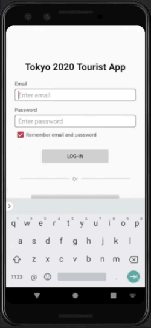

# Tokyo 2020 Tourism App 

### Tourist information app for the Tokyo 2020 Summer Olympics Game
#### ***DISCLAIMER: This app was developed as an exercise in native Android mobile application development and is not in any way affiliated with the Tokyo 2020 Summer Olympics organization.*** 

#### Technologies/Concepts used

* Room persistence library and sqlite read/write operations and target-specific queries

* Linear and Frame layouts, Fragments, WebView, Navigation Drawer, Toolbar, Intents, ListView

* Passing of data between activities using intents

* Android Youtube Player library

* Custom ListView adapters

* Call and email intent and permission handling, SMS permission and SMS Manager

* Calendar scheduling with notifications display

#### Screenshots  

                                   

#### Features

* User login and registration screen.

* Navigation menu that will allow users to access the different functions available within the app.

* Toolbar allowing users quick-access to sms, call, email and logout functions.

* Display clickable list of tourist attractions within Tokyo.

* Detailed display of Tokyo attraction with ability to show video of attraction, add it to wishlist option and set a rating.

* Ratings display for each attraction with aggregate rating from all registered users.

* Display of all scheduled games in the olympics as well as game schedules for a specific day specified by the user.

* Ability to set a reminder for an scheduled olympic game event.

* Admin interface that will allow users with admin privileges to add a tourist attraction in the sqlite database.

#### Link to specification: <a href="./docs/MADS4001 - Project Tourism App.pdf" target="_blank">[App Specification]</a>
