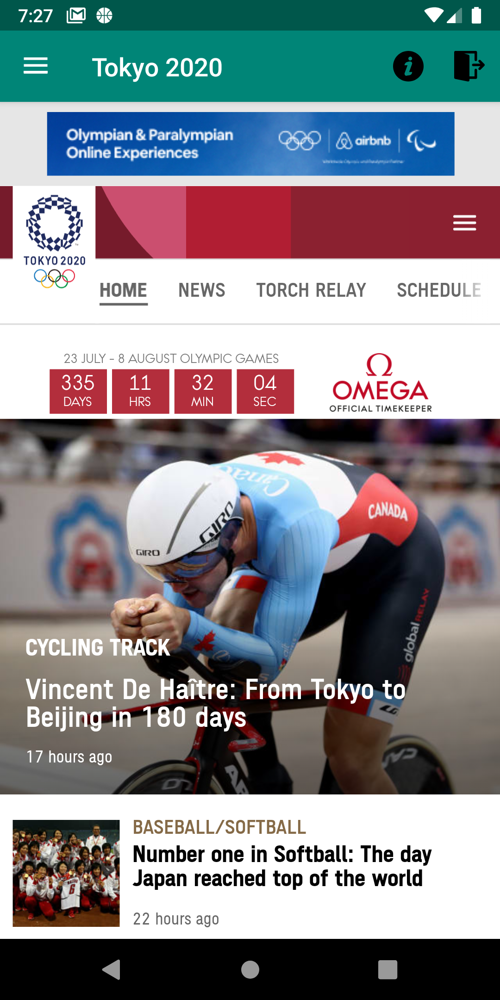
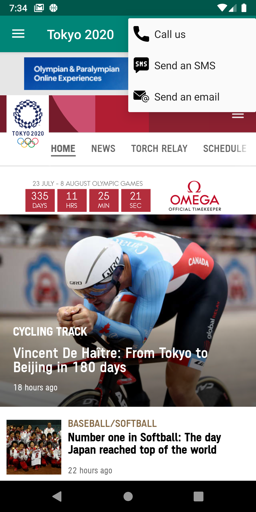

# Tokyo 2020 Tourism App 

### Tourist information app for the Tokyo 2020 Summer Olympics Game
#### ***DISCLAIMER: This app was developed as an exercise in native Android mobile application development and is not in any way affiliated with the Tokyo 2020 Summer Olympics organization.*** 

#### Screenshots  

                                             

#### Technologies/Concepts used

* Room persistence library

* Linear and Frame layouts

* Fragments, WebView, Navigation Drawer, Toolbar, Intents, ListView

* sqlite read/write operations and target-specific queries

* Passing of data between activities using intents

* Android Youtube Player library

* Custom ListView adapters

* Call and email intent and permission handling

* SMS permission and SMS Manager

* Calendar scheduling

#### Features

* User login and registration screen

* Navigation menu that will allow users to 

#### Link to specification: <a href="./docs/MADS4001 - Project Tourism App.pdf" target="_blank">[App Specification]</a>
